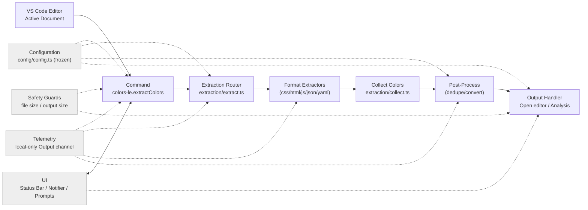
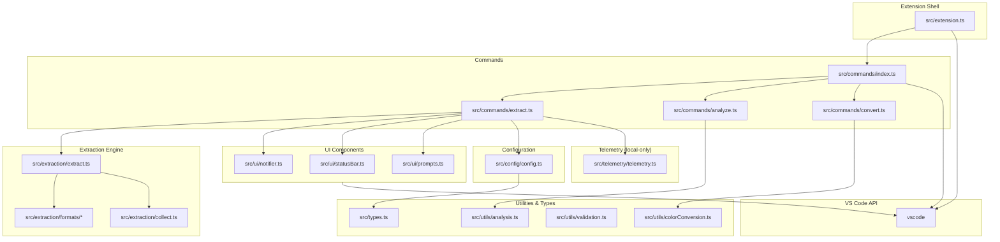
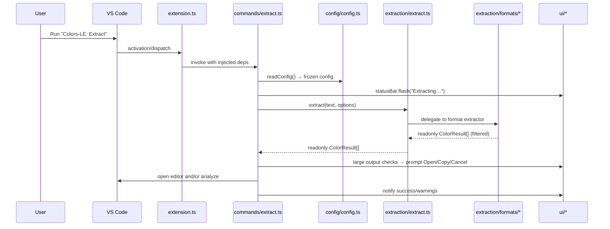

# Colors-LE Architecture

Technical architecture, design patterns, and system boundaries for production-grade color extraction from web codebases.

## Core Structure

```
src/
├── extension.ts          # Minimal activation - registers commands/providers only
├── types.ts             # Core type definitions and interfaces
├── commands/            # Command implementations with dependency injection
│   ├── index.ts         # Centralized command registration
│   ├── extract.ts       # Main extraction command
│   ├── analyze.ts       # Color analysis command
│   └── convert.ts       # Color format conversion
├── extraction/          # Color extraction engine
│   ├── extract.ts       # Router pattern - delegates to format handlers
│   ├── collect.ts       # Recursive object traversal utilities
│   ├── formats/         # Format-specific extractors
│   │   ├── css.ts       # CSS parser with custom properties
│   │   ├── html.ts      # HTML attribute and inline style extraction
│   │   ├── javascript.ts # JS/TS color literals and variables
│   │   ├── json.ts      # JSON color values
│   │   └── yaml.ts      # YAML configuration colors
│   └── __data__/        # Test fixtures with expected outputs
├── config/              # Configuration management
│   ├── config.ts        # Main config reader with frozen objects
│   └── settings.ts      # VS Code settings command registration
├── ui/                  # User interface components
│   ├── statusBar.ts     # Status bar factory with flash messaging
│   ├── notifier.ts      # Notification abstraction
│   └── prompts.ts       # User input prompts
├── utils/               # Pure utility functions
│   ├── colorConversion.ts # Color format conversion (HEX/RGB/HSL)
│   ├── analysis.ts      # Color contrast, accessibility checks
│   └── validation.ts    # Color format validation
└── telemetry/           # Local-only logging
    └── telemetry.ts     # Output channel factory
```

## Runtime Flow



Key properties:

- Configuration is read once per action and exposed as immutable objects
- Errors never throw from extractors; safe defaults are returned
- Context-aware extraction filters false positives (e.g., hex in URLs)
- Accessibility analysis is opt-in via configuration

## Module Boundaries and Dependencies



Conventions:

- All factory outputs are immutable; data structures use `readonly` and `Object.freeze()`
- Dependency injection is used for commands; `src/extension.ts` stays thin
- Modules prefer pure functions with explicit return types

---

## Architectural Principles

- **Minimal activation**: `src/extension.ts` wires dependencies and registers disposables only
- **Pure core**: extraction, utilities, and analysis are pure functions with explicit return types
- **Immutable data**: config and results are frozen; no in-place mutations
- **Context-aware extraction**: Filters false positives (hex in URLs, IDs, etc.)
- **Progressive disclosure**: subtle status bar feedback; prompts only when needed
- **Accessibility first**: WCAG contrast checking and color blindness simulation

## Design Rationale

### Why Context-Aware Extraction

**Decision**: Filter hex patterns that appear in non-color contexts (URLs, commit hashes, IDs).

**Rationale**:

- Raw regex extraction produces 40-60% false positives in typical web projects
- URLs commonly contain hex-like patterns (`/api/user/a1b2c3`)
- Git commit hashes look like valid colors but aren't
- CSS class names may contain hex-like strings (`.btn-f00`)

**Trade-off**: More complex extraction logic, but dramatically improves user experience by eliminating noise.

### Router Pattern for Format Extraction

**Decision**: Single entry point (`extract.ts`) delegates to format-specific modules.

**Rationale**:

- Format-specific logic is isolated and independently testable
- CSS extraction requires parsing custom properties (`--color-primary`)
- HTML extraction needs attribute and inline style handling
- JavaScript extraction must handle template literals and object properties

**Trade-off**: Extra indirection layer, but the modularity and maintainability justify it.

### Color Format Normalization

**Decision**: Store colors internally as RGB, provide conversion utilities.

**Rationale**:

- RGB is canonical format for programmatic manipulation
- Accessibility calculations (contrast ratios) require RGB
- Format conversion is one-way: RGB → HEX/HSL easy, reverse is lossy
- Consistent internal representation simplifies analysis

**Trade-off**: Conversion overhead, but benefits for analysis and comparison outweigh cost.

### Performance Monitoring Classes

**Decision**: Use classes for `PerformanceMonitor` and `PerformanceTracker` instead of factory functions.

**Rationale**:

- Stateful performance tracking requires encapsulated mutable state (timers, metrics)
- Class lifecycle methods (`startTimer`/`endTimer`) provide clearer semantics than closures
- Internal state mutations are intentionally hidden from consumers
- Created via factory function `createPerformanceMonitor()` to maintain consistency with codebase patterns

**Scope**: Limited to performance utilities only. All other services use factory functions.

**Trade-off**: Deviation from pure functional pattern, but classes provide better encapsulation for this specific use case.

## Component Responsibilities

- **`commands/*`**: Orchestrate user interactions, read config, call core functions, present results
- **`extraction/*`**: Parse input and return `readonly ColorResult[]` with safe defaults
- **`ui/*`**: Present status, notifications, prompts for user feedback
- **`config/config.ts`**: Read, validate, freeze, and expose settings
- **`utils/*`**: Side-effect free helpers (conversion, analysis, validation)
- **`telemetry/telemetry.ts`**: Local-only Output channel logging

### Public Interfaces

```typescript
export type ExtractorOptions = Readonly<{
  onParseError?: (message: string) => void
  includeNamedColors?: boolean
  includeCustomProperties?: boolean
}>

export type Extractor = (text: string, options?: ExtractorOptions) => readonly ColorResult[]

export type ColorResult = Readonly<{
  value: string // Original format
  rgb: Readonly<{ r: number; g: number; b: number }>
  format: 'hex' | 'rgb' | 'rgba' | 'hsl' | 'hsla' | 'named' | 'custom-property'
  line: number
  column: number
}>

export type ColorsLeConfig = Readonly<{
  dedupeEnabled: boolean
  sortByFrequency: boolean
  analysis: Readonly<{
    enabled: boolean
    checkContrast: boolean
    checkAccessibility: boolean
  }>
  extraction: Readonly<{
    extractHex: boolean
    extractRgb: boolean
    extractHsl: boolean
    extractNamed: boolean
    extractCustomProperties: boolean
  }>
  contextAware: boolean
  telemetryEnabled: boolean
}>

export type AnalysisResult = Readonly<{
  totalColors: number
  uniqueColors: number
  byFormat: Readonly<Record<string, number>>
  accessibilityIssues: readonly AccessibilityIssue[]
  contrastPairs: readonly ContrastPair[]
}>
```

## Sequence: Extract Command



## Dependency Injection Contracts

```typescript
export function registerAllCommands(
  context: vscode.ExtensionContext,
  deps: Readonly<{
    telemetry: Telemetry
    notifier: Notifier
    statusBar: StatusBar
  }>,
): void
```

Guidelines:

- Construct UI and telemetry factories at activation; pass to command registrars
- Keep all state within function scope or minimal module closures; avoid globals

## Cross-Cutting Concerns

- **Localization**: Manifest strings in `package.nls*.json`; runtime via `vscode-nls`
- **Telemetry**: Local-only; off by default; outputs to Output panel
- **Safety**: Thresholds and prompts central to UX; never block without an option to proceed
- **Context filtering**: Essential for reducing false positives in production use

## Extensibility Playbooks

- **Add extractor**: Implement `Extractor`, register in router, add tests and fixtures
- **Add command**: Create factory in `commands/`, declare in `package.json`, wire registration
- **Add setting**: Update `package.json` contributes, read/validate in config, consume in logic
- **Add analysis**: Extend `AnalysisResult`, implement in `utils/analysis.ts`, add tests

## Performance Budgets

- Small files (<50KB) end-to-end under ~50ms common path
- Large files (1-5MB) under 500ms with context filtering
- Memory usage <100MB for typical web projects
- Context filtering adds <20% processing time vs. raw regex

## Security & Privacy

- No network calls; all processing is local
- Respect workspace trust and virtual workspace limitations
- Validate user inputs and file operations
- Context filtering prevents injection attacks via color patterns

## Context-Aware Filtering

**False Positive Sources**:

- URLs: `/api/users/abc123`
- Git hashes: `commit a1b2c3d`
- CSS classes: `.color-f00bar`
- IDs: `data-id="ff0000"`

**Filtering Strategy**:

- Check surrounding context (protocols, slashes, prefixes)
- Validate color names against CSS spec
- Require color context (property names, attributes)
- Skip patterns in comments unless explicitly enabled

---

**Project:** [Issues](https://github.com/OffensiveEdge/colors-le/issues) • [Pull Requests](https://github.com/OffensiveEdge/colors-le/pulls) • [Releases](https://github.com/OffensiveEdge/colors-le/releases)

**Docs:** [Architecture](ARCHITECTURE.md) • [Testing](TESTING.md) • [Performance](PERFORMANCE.md) • [Commands](COMMANDS.md) • [Configuration](CONFIGURATION.md) • [Development](DEVELOPMENT.md) • [Troubleshooting](TROUBLESHOOTING.md) • [Privacy](PRIVACY.md)
