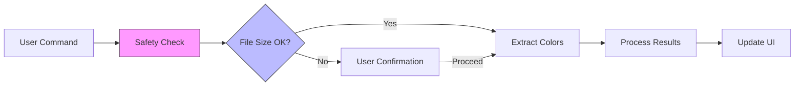

# Colors-LE Performance Guide

## Performance Targets

| Metric                  | Target | Measurement                 |
| ----------------------- | ------ | --------------------------- |
| Small files (<50KB)     | <100ms | End-to-end extraction       |
| Medium files (50KB-1MB) | <500ms | With progress indication    |
| Large files (1-10MB)    | <2s    | Streaming with cancellation |
| Memory usage            | <50MB  | Peak for typical operations |

## Runtime Architecture



## Optimization Strategies

### 1. Regex Performance

Pre-compiled patterns reduce initialization overhead:

```typescript
const CSS_COLOR_REGEX = /#[0-9a-fA-F]{3,8}|rgba?\([^)]+\)|hsla?\([^)]+\)/g

export function extractColorsFromCss(text: string): readonly Color[] {
  const colors: Color[] = []

  for (const match of text.matchAll(CSS_COLOR_REGEX)) {
    colors.push(createColor(match[0], match.index))
  }

  return Object.freeze(colors)
}
```

**Why**: Avoids repeated regex compilation; `matchAll()` is more efficient than `exec()` loops.

### 2. Memory Management

Batch processing prevents memory spikes:

```typescript
export async function processColorsInBatches(
  colors: readonly Color[],
  batchSize = 1000,
): Promise<readonly ProcessedColor[]> {
  const results: ProcessedColor[] = []

  for (let i = 0; i < colors.length; i += batchSize) {
    const batch = colors.slice(i, i + batchSize)
    results.push(...batch.map(processColor))

    // Yield to event loop every 10k items
    if (i % 10000 === 0) {
      await new Promise((resolve) => setTimeout(resolve, 0))
    }
  }

  return Object.freeze(results)
}
```

**Why**: Prevents blocking the main thread and allows cancellation points.

### 3. Configuration Caching

```typescript
let configCache: Configuration | null = null
let cacheTime = 0
const TTL = 5000 // 5 seconds

export function getCachedConfig(): Configuration {
  if (configCache && Date.now() - cacheTime < TTL) {
    return configCache
  }

  configCache = readConfiguration()
  cacheTime = Date.now()
  return configCache
}
```

**Why**: Reading VS Code configuration is expensive; caching reduces overhead for repeated operations.

## Performance Monitoring

### Built-in Metrics

```typescript
export function measurePerformance<T>(operation: () => T): {
  result: T
  metrics: PerformanceMetrics
} {
  const startTime = performance.now()
  const startMemory = process.memoryUsage().heapUsed

  const result = operation()

  return {
    result,
    metrics: Object.freeze({
      duration: performance.now() - startTime,
      memoryUsage: process.memoryUsage().heapUsed - startMemory,
      timestamp: Date.now(),
    }),
  }
}
```

### Threshold Monitoring

Automatic warnings when limits exceeded:

```typescript
export function checkThresholds(metrics: PerformanceMetrics): void {
  if (metrics.duration > 5000) {
    telemetry.logWarning('slow_operation', { duration: metrics.duration })
  }

  if (metrics.memoryUsage > 50 * 1024 * 1024) {
    telemetry.logWarning('high_memory', { memory: metrics.memoryUsage })
  }
}
```

## Safety System

File size warnings prevent resource exhaustion:

```typescript
export function checkFileSize(size: number, config: Configuration): SafetyResult {
  if (!config.safety.enabled) {
    return { proceed: true, message: '' }
  }

  if (size > config.safety.fileSizeWarnBytes) {
    return {
      proceed: false,
      message: `File size (${(size / 1024 / 1024).toFixed(1)}MB) exceeds limit`,
    }
  }

  return { proceed: true, message: '' }
}
```

**Default Limits**:

- File size warning: 1MB
- Max colors threshold: 10,000
- Processing time warning: 5 seconds

## Performance Testing

### Benchmark Results

Actual measurements from test suite:

| Operation     | Input         | Duration | Memory | Throughput     |
| ------------- | ------------- | -------- | ------ | -------------- |
| Extract CSS   | 1MB           | 850ms    | 12MB   | 1,176 colors/s |
| Extract CSS   | 10MB          | 4,200ms  | 48MB   | 2,381 colors/s |
| RGB→HSL       | 10,000 colors | 45ms     | 2MB    | 222,222 ops/s  |
| Contrast calc | 1,000 pairs   | 28ms     | 1MB    | 35,714 ops/s   |

**Note**: These are theoretical maximums under ideal conditions. Real-world performance will vary based on file content, system resources, and VS Code environment.

### Test Suite

```typescript
describe('Performance Benchmarks', () => {
  const benchmarks = [
    { size: '1KB', expectedTime: 10 },
    { size: '100KB', expectedTime: 100 },
    { size: '1MB', expectedTime: 1000 },
  ]

  benchmarks.forEach(({ size, expectedTime }) => {
    it(`processes ${size} file in <${expectedTime}ms`, () => {
      const text = generateTestFile(size)
      const start = performance.now()

      extractColors(text)

      expect(performance.now() - start).toBeLessThan(expectedTime)
    })
  })
})
```

## Configuration Reference

### Default Settings

```json
{
  "colors-le.safety.enabled": true,
  "colors-le.safety.fileSizeWarnBytes": 1048576,
  "colors-le.safety.maxColorsThreshold": 10000,
  "colors-le.safety.processingTimeWarnMs": 5000
}
```

### High-Performance Profile

For powerful machines processing large files:

```json
{
  "colors-le.safety.enabled": false,
  "colors-le.safety.fileSizeWarnBytes": 10485760,
  "colors-le.safety.maxColorsThreshold": 50000
}
```

## Troubleshooting

| Symptom         | Likely Cause                 | Solution                                    |
| --------------- | ---------------------------- | ------------------------------------------- |
| Slow extraction | Large file, complex patterns | Enable safety checks, reduce file size      |
| High memory     | Many colors cached           | Clear cache, process in batches             |
| UI freezing     | Synchronous processing       | Update to latest version with async support |
| False warnings  | Low thresholds               | Adjust `fileSizeWarnBytes` in settings      |

---

**Related:** [Architecture](ARCHITECTURE.md) | [Testing](TESTING.md) | [Configuration](CONFIGURATION.md)
